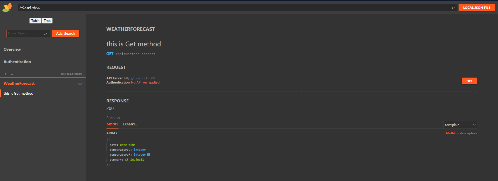
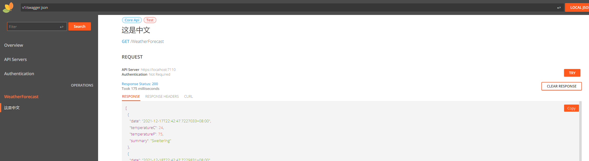

<div align="center">
<h1 align="center">   IGeekFan.AspNetCore.RapiDoc </h1>

**[RapiDoc](https://github.com/mrin9/RapiDoc)** Custom Element for Open-API spec viewing ，Support .NET Core3.1 、.NET Standard2.0、.NET5.0、.NET6.0。

[](https://www.jetbrains.com/rider/)
[](https://raw.githubusercontent.com/luoyunchong/IGeekFan.AspNetCore.RapiDoc/master/LICENSE)
<p>
    <span>English</span> |  
    <a href="README.zh-CN.md">中文</a>
</p>
</div>

An API document that implements swagger 2.0 and OpenAPI 3.0. I integrate it into aspnetcore。

## Features
- Supports Swagger 2.0 and OpenAPI 3.0
- Works with any framework or with no framework
- Allows making API calls. And More....
- For more features, please refer to **[RapiDoc](https://github.com/mrin9/RapiDoc) README**

## Nuget Packages

Package name                              | Version                     | Downloads
------------------------------------------|-----------------------------|-------------
`IGeekFan.AspNetCore.RapiDoc` | [](https://www.nuget.org/packages/IGeekFan.AspNetCore.RapiDoc/) | 
`IGeekFan.AspNetCore.RapiDoc.Extra` | [](https://www.nuget.org/packages/IGeekFan.AspNetCore.RapiDoc.Extra/) | 

 
## Dependencies
### [RapiDoc](https://github.com/mrin9/RapiDoc)
- rapidoc^(version) [https://www.npmjs.com/package/rapidoc](https://www.npmjs.com/package/rapidoc)
### [Swashbuckle.AspNetCore](https://github.com/domaindrivendev/Swashbuckle.AspNetCore)
- Swashbuckle.AspNetCore.Swagger
- Swashbuckle.AspNetCore.SwaggerGen

## Demo
- [Basic](https://github.com/luoyunchong/IGeekFan.AspNetCore.RapiDoc/blob/master/test/Basic)
- [RapiDocDemo](https://github.com/luoyunchong/IGeekFan.AspNetCore.RapiDoc/blob/master/test/RapiDocDemo)
- [OAuth2Integration](https://github.com/luoyunchong/IGeekFan.AspNetCore.RapiDoc/blob/master/test/WebSites/OAuth2Integration)
- [ASPNET Core 6](https://github.com/luoyunchong/IGeekFan.AspNetCore.RapiDoc/blob/master/test/AspNetCore6_RapiDemo)
## 📚 QuickStart

### 🚀 Install Package
use Swashbuckle.AspNetCore.Swagger Components

1.Install the standard Nuget package into your ASP.NET Core application.

```
Package Manager : 

Install-Package Swashbuckle.AspNetCore.Swagger
Install-Package Swashbuckle.AspNetCore.SwaggerGen
Install-Package IGeekFan.AspNetCore.RapiDoc

OR

CLI :

dotnet add package Swashbuckle.AspNetCore.Swagger
dotnet add package Swashbuckle.AspNetCore.SwaggerGen
dotnet add package IGeekFan.AspNetCore.RapiDoc
```

2.In the ConfigureServices method of Startup.cs, register the Swagger generator, defining one or more Swagger documents.

```
using Microsoft.AspNetCore.Mvc.Controllers
using Microsoft.OpenApi.Models;
using Swashbuckle.AspNetCore.SwaggerGen;
using IGeekFan.AspNetCore.RapiDoc;
```
### 🚁 ConfigureServices

3.Services Configure
```
   services.AddSwaggerGen(c =>
    {
        c.SwaggerDoc("v1",new OpenApiInfo{Title = "API V1",Version = "v1"});
        var filePath = Path.Combine(System.AppContext.BaseDirectory,$"{typeof(Startup).Assembly.GetName().Name}.xml");
        c.IncludeXmlComments(filePath, true);
    });
```

### 💪 Configure
4. Middleware Configure
```
app.UseSwagger();

app.UseRapiDocUI(c =>
{
    c.RoutePrefix = ""; // serve the UI at root
    c.SwaggerEndpoint("/v1/api-docs", "V1 Docs");
    c.GenericRapiConfig = new GenericRapiConfig()
    {
        RenderStyle="focused",
        Theme="light",//light,dark,focused   
    };
});

app.UseEndpoints(endpoints =>
{
    endpoints.MapControllers();
    endpoints.MapSwagger("{documentName}/api-docs");
});
```
[https://mrin9.github.io/RapiDoc/api.html](https://mrin9.github.io/RapiDoc/api.html) GenericRapiConfig Configuration items refer to this document

### 🔎 Views
Run Project，Open WebSite https://localhost:5001/index.html#/home



5.More Configure

To add comments to a document, right-click on the project - properties - generate


In AddSwaggerGen Methods You should add this methond

```
c.IncludeXmlComments(Path.Combine(AppContext.BaseDirectory, "SwaggerDemo.xml"),true);
```
The last parameter is set to true to enable comments on the controller


### NSwag.AspNetCore

Another way

Please refer to the table of contents [test/WebSites/NSwag.Swagger.RapiDoc](https://github.com/luoyunchong/IGeekFan.AspNetCore.RapiDoc/tree/master/test/WebSites/NSwag.Swagger.RapiDoc)

```
Package Manager : 

Install-Package IGeekFan.AspNetCore.RapiDoc

OR

CLI :

dotnet add package NSwag.AspNetCore
```

```
public void ConfigureServices(IServiceCollection services)
 {
    // 其它Service
     services.AddOpenApiDocument();
 }
```

```
public void Configure(IApplicationBuilder app, IWebHostEnvironment env)
{
        // 其它 Use
      app.UseOpenApi();
      app.UseRapiDocUI(c =>
     {
           c.RoutePrefix = "";
           c.SwaggerEndpoint("/swagger/v1/swagger.json");
      });
}
```
Every Things is Ok. Now， You can visist RapiDoc


### IGeekFan.AspNetCore.RapiDoc.Extra
There is only one class，Display labels on methods through 'filter'

CLI 
```
dotnet add package IGeekFan.AspNetCore.RapiDoc.Extra
```

in AddSwaggerGen services add `RapiDocLableOperationFilter` Filter、

Your need add this namespace`IGeekFan.AspNetCore.RapiDoc.Extra`

```diff
builder.Services.AddSwaggerGen(c =>
{
+   c.OperationFilter<RapiDocLableOperationFilter>();
    var filePath = Path.Combine(System.AppContext.BaseDirectory, $"{typeof(Program).Assembly.GetName().Name}.xml");
    c.IncludeXmlComments(filePath, true);
    c.SwaggerDoc("v1", new OpenApiInfo { Title = "AspNetCore6_RapiDemo", Version = "v1" });
});
```


In Your Controller，You can add this attribute to the method

```diff
+   [RapiDocLabel("Core Api")]
+   [RapiDocLabel("Test",RapiDocColor.RED)]
    [HttpGet(Name = "GetWeatherForecast")]
    public IEnumerable<WeatherForecast> Get()
    {
        return null;
    }
```
Views



- In appsettings.json 

```csharp
builder.Services.Configure<RapiDocOptions>(c =>{
    builder.Configuration.Bind("RapiDoc", c);
});
```

aoosettings.json
```json
 "RapiDoc": {
    "RoutePrefix": "swagger",
    "DocumentTitle": "ASPNET CORE 6 RAPI DOC",
    "GenericRapiConfig": {
      "Theme": "dark"
    }
  }
```
Use Middleware Config Higher priority, All GenericRapiConfig can configuration in you appsettings.json,Please refer to this documents [https://mrin9.github.io/RapiDoc/api.html](https://mrin9.github.io/RapiDoc/api.html)
```csharp
 app.UseRapiDocUI(c =>
    {
        //This Config Higher priority
        c.GenericRapiConfig = new GenericRapiConfig()
        {
            RenderStyle= "read",//read | view | focused
            Theme="light",//light | dark
            SchemaStyle= "table"//tree | table
        };

    });
```

### More Configure

- [https://github.com/domaindrivendev/Swashbuckle.AspNetCore](https://github.com/domaindrivendev/Swashbuckle.AspNetCore)
- [https://mrin9.github.io/RapiDoc/api.html](https://mrin9.github.io/RapiDoc/api.html)

